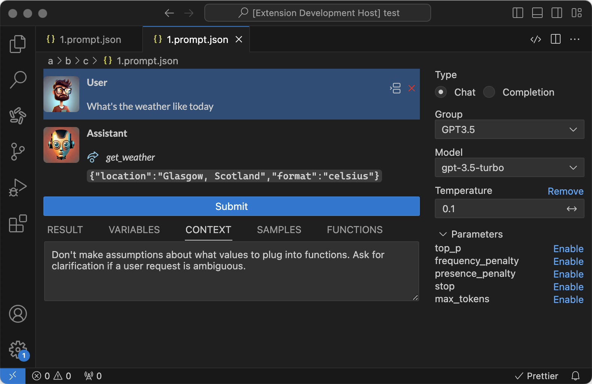

# Prompt IDE

<h2>Prompt IDE</h2>

_**ALERT: Prompt IDE IS IN ALPHA AND IS SUBJECT TO CHANGE.**_

When developing applications using LLM, you may encounter different types of LLM providers and frequently need to modify prompts. However, since there is no standard tool for this, you often have to switch between different playgrounds and message formats.

PromptIDE is a Visual Studio Code extension that helps you create and test prompts in a unified format provided by Prompt Schema.

You can install the extension from Visual Studio [Marketplace](https://marketplace.visualstudio.com/items?itemName=riguz.prompt-ide).

The extension logo is <a href="http://www.freepik.com">Designed by Mudassir101 / Freepik</a>.
